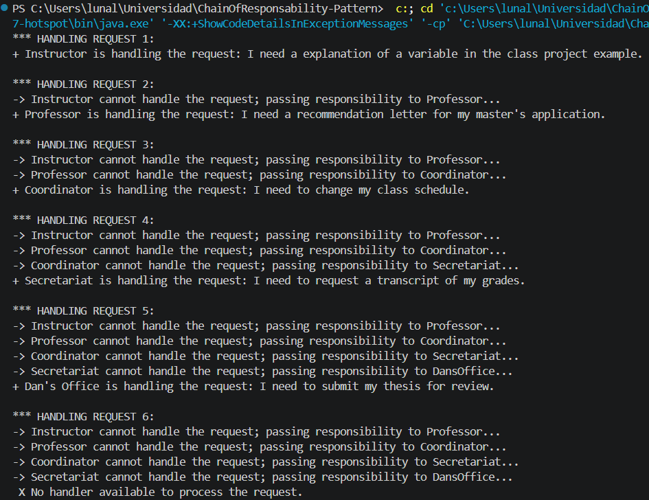

# Chain of Responsibility Pattern

> Behavioral design pattern

## Description

This project implements an academic workflow for handling different types of student requests with different levels of complexity.

The **Chain of Responsibility** pattern is used to represent the academic workflow, where each handler is responsible for determining whether it can handle a request. If it cannot handle the request, it passes it to the next handler in the chain.

The chain is structured as follows:

`Instructor` → `Professor` → `Coordinator` → `Secretary` → `Dean's Office`

The student request is initially sent to the `Instructor`. From there, the request moves through the chain until a handler with the appropriate responsibility processes it.

This allows the client to submit a request without needing to know which handler is responsible for it.

## UML Diagram

## Project Structure

* **Interface:** `Handler`
* **Abstract class:** `BaseHandler`
* **Classes:**

  * `Instructor`
  * `Professor`
  * `Coordinator`
  * `Secretary`
  * `DeanOffice`
* **Client:** `Client` (Main)

## How to Run

1. Clone or download the repository.
2. Open the project in a Java-compatible IDE such as VS Code, IntelliJ IDEA, or Eclipse.
3. Make sure Java is correctly installed and configured.
4. Run the `Client` class.
5. Check the console output to observe how the different student requests are handled.
6. Verify that the six test cases are processed by the appropriate handlers in the chain.

## Console Output

## Analysis

### Why is Chain of Responsibility appropriate for this problem?

The Chain of Responsibility pattern is well-suited to this scenario, as it allows each 'responsible' in the academic workflow to be represented as an independent object. Each headler is responsible for determining whether it can process a student's request; if not, the request is passed to the next headler in the chain.

This design reflects a real academic workflow, where a student request may require review by different levels of responsibility depending on its type or complexity.

Another key advantage is that the client doesn't need to know which headler should process each request; they simply need to send it to the first headler in the chain, and the chain itself determines how the request should be routed. Furthermore, the design is flexible and extensible, allowing new headlers to be added to the chain without requiring significant changes to the client or existing headlers.

*Last Modification: 04/09/2026*
